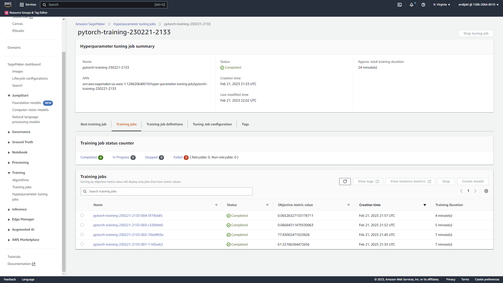
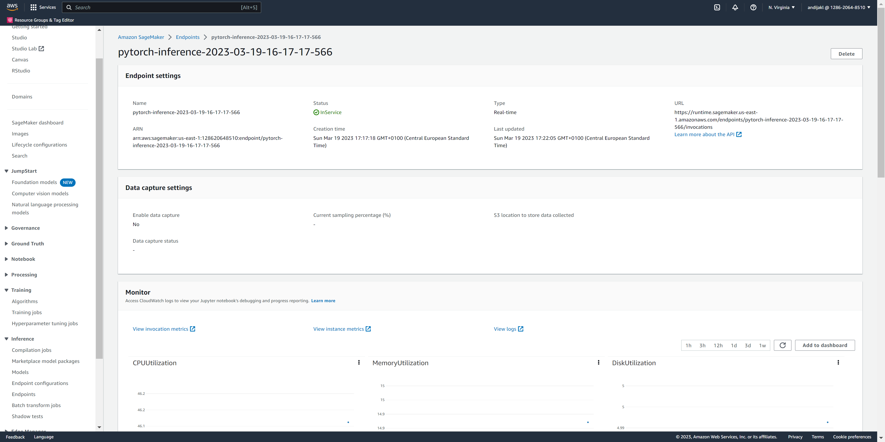
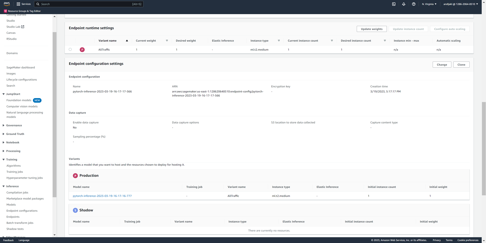

# Image Classification using AWS SageMaker

Use AWS Sagemaker to train a pretrained model that can perform image classification by using the Sagemaker profiling, debugger, hyperparameter tuning and other good ML engineering practices.

This project is using the dog breed classication data set and applying a ResNet50 model with transfer learning. At first, we're doing hyperparameter tuning using a smaller fraction of the dataset. Afterwards, we're training the model with the best hyperparameters on the full dataset. This is monitored by debugger and profiling hooks using the Sagemaker tools. At the end, the final model is deployed to an endpoint and queried using a sample image.

## Project Set Up and Installation

First, the Sagemaker instance is created. In my case, I'm using my own AWS account and not the Udacity classroom.

## Dataset
The provided dataset is the dogbreed classification dataset which can be found in the classroom.
It contains training, test and validation images for various dog breeds - you can see more details in the train_and_deploy notebook.

### Access
Next, the extracted data is uploaded to S3; either aws s3 sync command line tool.

## Hyperparameter Tuning
I used the resnet50 pretrained model provided by PyTorch, as it is a powerful model that is well suited to distinguish objects like in this task. The last layer is replaced with an own layer to make it suitable for dog breed classification.

For the hyperparameter tuning, I tested batch size and learning rates in various ranges. The best hyperparameters are the ones that minimize the loss.

* A screenshot of completed training jobs:



* Logs metrics during the training process

|	|batch-size	|lr	|TrainingJobName	|TrainingJobStatus	|FinalObjectiveValue	|TrainingStartTime	|TrainingEndTime	|TrainingElapsedTimeSeconds|
|---|-------|-----------|-------------------------------------------|-----------|-----------|---------------------------|---------------------------|-----|
|0	|"32"	|0.003251	|pytorch-training-230221-2133-004-5f79cb85	|Completed	|0.065263	|2023-02-21 21:57:49+00:00	|2023-02-21 22:02:17+00:00	|268.0|
|1	|"32"	|0.001084	|pytorch-training-230221-2133-003-c320b9e0	|Completed	|0.066843	|2023-02-21 21:52:33+00:00	|2023-02-21 21:57:05+00:00	|272.0|
|2	|"512"	|0.096445	|pytorch-training-230221-2133-002-70dd903a	|Completed	|77.830025	|2023-02-21 21:44:01+00:00	|2023-02-21 21:51:04+00:00	|423.0|
|3	|"512"	|0.089827	|pytorch-training-230221-2133-001-1143ce62	|Completed	|61.521866	|2023-02-21 21:34:46+00:00	|2023-02-21 21:42:14+00:00	|448.0|

* Tune at least two hyperparameters

Tuned both batch-size and learning rate.

* Retrieve the best best hyperparameters from all your training jobs

The best parameters from the hpo tuning were:

* batch-size: 32
* learning rate: 0.0032505765136462395

## Debugging and Profiling

I performed training and debugging through the Amazon SageMaker library SMDebug. I added the corresponding calls to the hpo.py (which I extended so that it can also be used for training by configuring a parameter, instead of running the extra train_model.py script). Both the test and train functions set hooks to measure performance during training.

Profiling gives insights for example about memory and CPU usage of the instances. This can be used for example to identify bottlenecks.

### Results

I performed training using an ml.m5.2xlarge instance; overall, it took 21 minutes.
The profiler report is available in the ProfilerReport subdirectory.

As expected, most of the time was spent for training (around 92%), around 4% for eval and the rest for other tasks running the training job. None of the triggers occured during this training job (e.g., for very low or too high CPU load, IO bottleneck), which is expected as I used a rather powerful machine for training. The mean step duration was around 2 seconds, as the batch size is rather small.


## Model Deployment

I deployed the finished model to a SageMaker endpoint for inference. I used the ml.t2.medium instance type, as it has a rather low cost. Executing a trained model doesn't take much computing resources, especially in our scenario when just testing the deployment and not requiring a massive amount of live inference from multiple clients.

The inference.py script is running on that instance and is using the computed model to make predictions. As can be seen in the script, the endpoint gets a name, e.g., 'pytorch-inference-2023-02-28-21-48-48-586'. 

It is possible to access the endpoint through the Sagemaker SDK. Based on the URL of an image, this can then be sent to the endpoint:

```python
image_bytes = requests.get(url).content
response=predictor.predict(image_bytes, initial_args={"ContentType": "image/jpeg"})
```

It is also possible to retrieve the endpoint through its name. The cloudwatch log allow checking the output of the inference.py script. In this case, it detects the content type of image/jpeg. The request body type is bytearray. According to the logs, the prediction time was 150 ms.

* Screenshots of the deployed endpoint:




